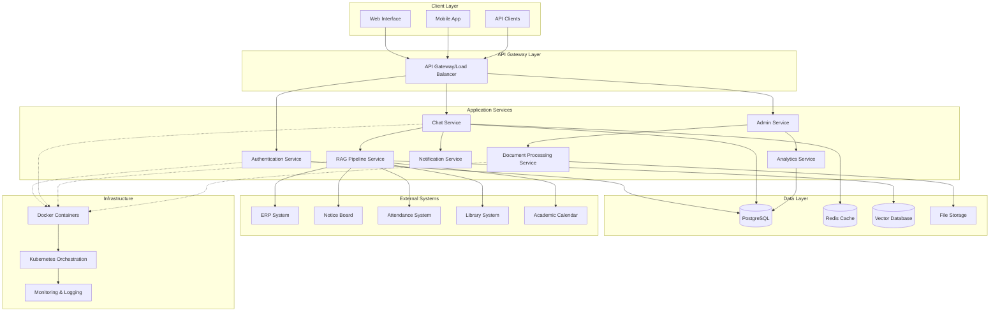

# Design Document: College Department AI Chatbot System

## Overview

The College Department AI Chatbot System is an enterprise-grade intelligent conversational platform designed to serve college departments with comprehensive data integration, AI-powered analysis, and multi-user support. The system provides real-time access to departmental information through a sophisticated RAG (Retrieval-Augmented Generation) pipeline, intelligent question answering, document processing capabilities, and administrative management tools while maintaining high security and scalability standards.

### Key Features

- **Enterprise-level AI chatbot** with FastAPI backend for high-performance API services
- **Real-time data integration** with ERP, attendance, and notice board systems
- **RAG pipeline** with vector database (FAISS/ChromaDB) for semantic search and context-aware responses
- **Document processing** with OCR support for PDF, Excel, Word, and image formats
- **Multi-user concurrent support** for 100+ simultaneous users
- **Role-based access control** with secure authentication and authorization
- **WebSocket real-time communication** for instant messaging and live updates
- **PostgreSQL database** with Redis caching for optimal performance
- **Microservice architecture** with Docker/Kubernetes deployment for scalability
- **Comprehensive admin interface** for system management and configuration
- **Analytics dashboard** with usage metrics and performance monitoring
- **Security and monitoring** with encryption, audit trails, and compliance features

## Architecture

### System Architecture Overview

The system follows a microservice architecture pattern with clear separation of concerns:


### Microservice Components

#### 1. Authentication Service
- **Purpose**: User authentication, authorization, and session management
- **Technology**: FastAPI, JWT tokens, bcrypt password hashing
- **Responsibilities**:
  - User login/logout
  - Role-based access control (RBAC)
  - Session management
  - Multi-factor authentication (MFA)
  - Security event logging

#### 2. Chat Service
- **Purpose**: Core chatbot functionality and conversation management
- **Technology**: FastAPI, WebSocket, asyncio
- **Responsibilities**:
  - Message handling and routing
  - Conversation context management
  - Real-time communication via WebSocket
  - Chat history storage and retrieval
  - Session state management

#### 3. RAG Pipeline Service
- **Purpose**: Retrieval-Augmented Generation for intelligent responses
- **Technology**: Python, Transformers, LangChain, FAISS/ChromaDB
- **Responsibilities**:
  - Query processing and embedding generation
  - Semantic search across knowledge base
  - Context retrieval from vector database
  - Response generation using language models
  - Source attribution and confidence scoring

#### 4. Document Processing Service
- **Purpose**: Document ingestion, processing, and knowledge base management
- **Technology**: Python, PyPDF2, python-docx, Tesseract OCR, Celery
- **Responsibilities**:
  - Document upload and validation
  - Text extraction from various formats (PDF, Word, Excel)
  - OCR processing for scanned documents and images
  - Content chunking and preprocessing
  - Vector embedding generation and storage

#### 5. Notification Service
- **Purpose**: Multi-channel notification delivery and management
- **Technology**: FastAPI, Celery, Redis, SMTP, SMS APIs
- **Responsibilities**:
  - Real-time notification delivery
  - Multi-channel support (email, in-app, SMS)
  - Notification preferences management
  - Delivery status tracking
  - Notification history and analytics

#### 6. Admin Service
- **Purpose**: Administrative interface and system management
- **Technology**: FastAPI, React Admin Dashboard
- **Responsibilities**:
  - User management and role assignment
  - Knowledge base administration
  - System configuration management
  - Document management interface
  - Administrative action logging

#### 7. Analytics Service
- **Purpose**: System monitoring, metrics collection, and reporting
- **Technology**: FastAPI, Prometheus, Grafana, Elasticsearch
- **Responsibilities**:
  - Usage metrics collection and analysis
  - Performance monitoring and alerting
  - User behavior analytics
  - System health dashboards
  - Report generation and export

## Components and Interfaces

### Core Components

#### Authentication Component
```python
class AuthenticationService:
    def authenticate_user(self, credentials: UserCredentials) -> AuthResult
    def authorize_action(self, user: User, action: str, resource: str) -> bool
    def create_session(self, user: User) -> Session
    def validate_token(self, token: str) -> TokenValidation
    def enable_mfa(self, user: User, method: MFAMethod) -> MFASetup
```

#### RAG Pipeline Component
```python
class RAGPipeline:
    def process_query(self, query: str, context: ConversationContext) -> Response
    def retrieve_context(self, query_embedding: Vector) -> List[Document]
    def generate_response(self, query: str, context: List[Document]) -> GeneratedResponse
    def update_knowledge_base(self, documents: List[Document]) -> UpdateResult
```

#### Document Processor Component
```python
class DocumentProcessor:
    def extract_text(self, document: UploadedFile) -> ExtractedText
    def perform_ocr(self, image_document: UploadedFile) -> OCRResult
    def chunk_content(self, text: str) -> List[TextChunk]
    def generate_embeddings(self, chunks: List[TextChunk]) -> List[Vector]
```

#### Real-Time Engine Component
```python
class RealTimeEngine:
    def establish_connection(self, user: User) -> WebSocketConnection
    def broadcast_message(self, message: Message, recipients: List[User]) -> None
    def handle_connection_failure(self, connection: WebSocketConnection) -> None
    def maintain_session_state(self, session: ChatSession) -> None
```

### External System Interfaces

#### ERP System Interface
```python
class ERPIntegration:
    def get_student_data(self, student_id: str) -> StudentData
    def get_course_information(self, course_id: str) -> CourseData
    def get_faculty_data(self, faculty_id: str) -> FacultyData
    def sync_data_changes(self) -> SyncResult
```

#### Notice Board Interface
```python
class NoticeBoardIntegration:
    def fetch_announcements(self, department: str) -> List[Announcement]
    def subscribe_to_updates(self, callback: Callable) -> Subscription
    def get_urgent_notices(self) -> List[UrgentNotice]
```

#### Attendance System Interface
```python
class AttendanceIntegration:
    def get_attendance_data(self, user_id: str, date_range: DateRange) -> AttendanceData
    def get_class_attendance(self, class_id: str) -> ClassAttendance
    def sync_attendance_updates(self) -> SyncResult
```

### API Endpoints

#### Authentication Endpoints
- `POST /auth/login` - User authentication
- `POST /auth/logout` - User logout
- `POST /auth/refresh` - Token refresh
- `POST /auth/mfa/setup` - MFA configuration
- `GET /auth/profile` - User profile information

#### Chat Endpoints
- `POST /chat/message` - Send chat message
- `GET /chat/history/{user_id}` - Retrieve chat history
- `WebSocket /chat/ws` - Real-time chat connection
- `GET /chat/sessions` - List active sessions
- `DELETE /chat/session/{session_id}` - End chat session

#### Document Management Endpoints
- `POST /documents/upload` - Upload document
- `GET /documents/{document_id}` - Retrieve document
- `PUT /documents/{document_id}` - Update document
- `DELETE /documents/{document_id}` - Delete document
- `GET /documents/search` - Search documents

#### Admin Endpoints
- `GET /admin/users` - List users
- `POST /admin/users` - Create user
- `PUT /admin/users/{user_id}` - Update user
- `DELETE /admin/users/{user_id}` - Delete user
- `GET /admin/analytics` - System analytics
- `POST /admin/config` - Update system configuration